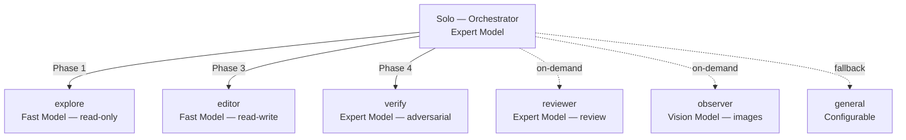
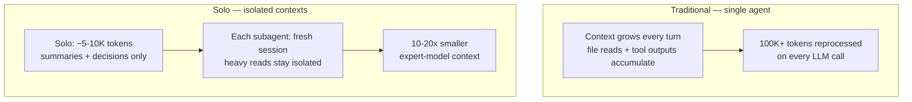
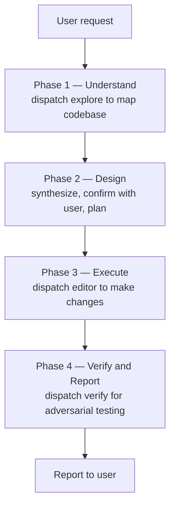

<p align="center">
  <a href="https://github.com/Dqz00116/opencode-solo">
    <picture>
      <source srcset="./assets/logo-dark.svg" media="(prefers-color-scheme: dark)">
      <source srcset="./assets/logo-light.svg" media="(prefers-color-scheme: light)">
      
    </picture>
  </a>
</p>
<p align="center">A read-only orchestrator + specialized subagent system for <a href="https://opencode.ai">opencode</a>.</p>
<p align="center">
  
  
</p>

<p align="center">
  <a href="./README.md">English</a> |
  <a href="./README.zh-CN.md">简体中文</a>
</p>

---

### Overview

Solo is a primary agent that **never touches files directly** — it plans, delegates, verifies, and reports. All operational work flows through specialized subagents, each with its own isolated session, permission set, and system prompt.



### Why Solo?

**Context isolation saves tokens.** In a traditional single-agent setup, every file read and tool output accumulates in one growing context — 100K+ tokens reprocessed on every LLM call. Solo isolates each task in its own subagent session, so Solo's context stays at ~5-10K tokens of summaries and decisions.



**Expert for planning, fast for execution.** Because Solo's context is small, you can run an expert model for orchestration while using fast, cheaper models for mechanical work:

| Tier | Agents | Why |
|------|--------|-----|
| **Expert** | Solo, verify, reviewer | Planning, adversarial analysis, quality judgment |
| **Fast** | explore, editor | File search, code editing, shell commands |
| **Specialized** | observer | Vision / multimodal |

> [!TIP]
> This tiering gives you expert-quality planning at a fraction of the cost — the expert model processes 10K tokens instead of 100K+.

<details>
<summary>Research backing</summary>

This architecture is grounded in active research on cost-efficient LLM systems:

1. Cai, T., Wang, X., Ma, T., Chen, X., & Zhou, D. (2023). [Large Language Models as Tool Makers](https://arxiv.org/abs/2305.17126). *arXiv preprint arXiv:2305.17126*. Google DeepMind.
2. Chen, L., Zaharia, M., & Zou, J. (2023). [FrugalGPT: How to Use Large Language Models While Reducing Cost and Improving Performance](https://arxiv.org/abs/2305.05176). *arXiv preprint arXiv:2305.05176*. Stanford University.
3. Ong, I., Almahairi, A., Wu, V., Chiang, W.-L., Wu, T., Gonzalez, J. E., Kadous, M. W., & Stoica, I. (2024). [RouteLLM: Learning to Route LLMs with Preference Data](https://arxiv.org/abs/2406.18665). *arXiv preprint arXiv:2406.18665*. UC Berkeley.
4. Hong, S., Zhuge, M., Chen, J., Zheng, X., Cheng, Y., Zhang, C., et al. (2024). [MetaGPT: Meta Programming for A Multi-Agent Collaborative Framework](https://arxiv.org/abs/2308.00352). In *ICLR 2024*.
5. Qian, C., Liu, W., Liu, H., Chen, N., Dang, Y., et al. (2024). [ChatDev: Communicative Agents for Software Development](https://arxiv.org/abs/2307.07924). In *ACL 2024*.

</details>

### Agents

- **solo** - Orchestrator. Zero file/shell access. Plans, delegates, verifies, reports.
- **explore** - Read-only research. Fast model. Maps codebase, finds files, answers questions.
- **editor** - File I/O + Shell. Fast model. Executes changes exactly as instructed.
- **verify** - Adversarial verification. Expert model. Tries to break the change — runs real probes, hunts for edge cases.
- **reviewer** - Code quality review. Expert model. On-demand. Evaluates readability, architecture, naming, conventions.
- **observer** - Visual analysis. Vision model. Screenshots, diagrams, charts.
- **general** - Fallback. Research + execution in one agent.

### Quick Start

**1. Install agent files**

```bash
git clone https://github.com/Dqz00116/opencode-solo.git
cp opencode-solo/agent/*.md ~/.config/opencode/agent/
```

> [!TIP]
> Windows PowerShell: `Copy-Item opencode-solo\agent\*.md $env:USERPROFILE\.config\opencode\agent\`

**2. Configure models**

Agent files are **model-agnostic**. Map each agent to a provider in your `opencode.jsonc`:

```bash
cp opencode-solo/opencode.jsonc.example ~/.config/opencode/opencode.jsonc
```

Edit the file — replace placeholders with your own models. See [opencode.jsonc.example](./opencode.jsonc.example).

**3. Enable background subagents** (recommended)

```bash
# macOS / Linux
export OPENCODE_EXPERIMENTAL_BACKGROUND_SUBAGENTS=true
```

```powershell
# Windows PowerShell (persistent, restart terminal after)
[System.Environment]::SetEnvironmentVariable("OPENCODE_EXPERIMENTAL_BACKGROUND_SUBAGENTS", "true", "User")
```

**4. Launch opencode and select the `solo` agent.**

### Workflow



### File Structure

```
agent/
├── solo.md         Orchestrator — read-only, delegates everything
├── verify.md       Adversarial verification — tries to break changes
├── explore.md      Read-only research — fast, parallel codebase search
├── editor.md       Execution — file I/O and shell commands
├── general.md      Fallback — research + execution in one agent
├── observer.md     Vision — screenshots, diagrams, image analysis
└── reviewer.md     Code review — quality, architecture, conventions
```

All `.md` files contain only behavior (prompt, permissions, mode). Models are configured separately in `opencode.jsonc`.

### Requirements

- [opencode](https://opencode.ai)
- At least one LLM provider configured
