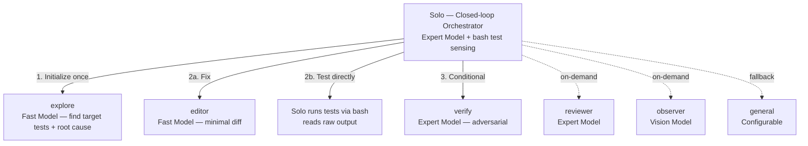
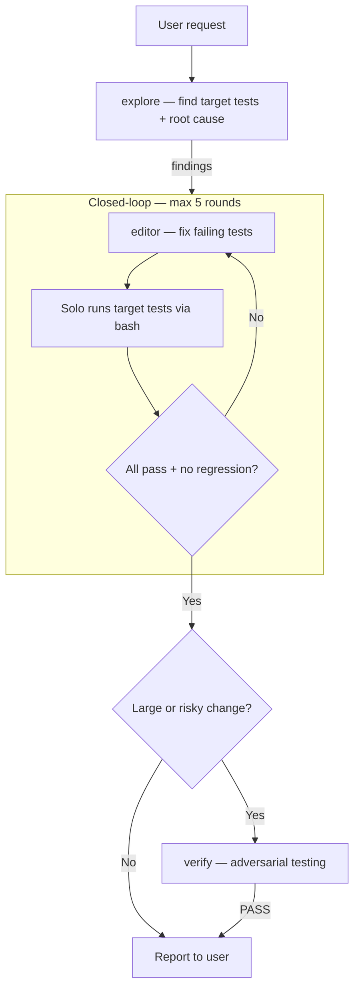

<p align="center">
  <a href="https://github.com/Dqz00116/opencode-solo">
    <picture>
      <source srcset="./assets/logo-dark.svg" media="(prefers-color-scheme: dark)">
      <source srcset="./assets/logo-light.svg" media="(prefers-color-scheme: light)">
      
    </picture>
  </a>
</p>
<p align="center">A closed-loop orchestrator + specialized subagent system for <a href="https://opencode.ai">opencode</a>.</p>
<p align="center">
  
  
  
</p>

<p align="center">
  <a href="./README.md">English</a> |
  <a href="./README.zh-CN.md">简体中文</a>
</p>

---

### Overview

Solo is a primary agent that orchestrates a **closed-loop workflow** — it directly senses test results via bash and delegates all code changes to specialized subagents. It iterates: edit → run tests → decide, until target tests pass.



### Why Solo?

**Closed-loop feedback.** Solo directly runs target tests via bash and reads raw output, using the failing-test count as an error signal. It iterates until tests pass — then stops immediately. This eliminates the open-loop "plan-then-execute" pattern where an agent fires off changes and hopes they work.

**Context isolation saves tokens.** Heavy file reads and tool outputs stay in subagent sessions. Solo's context holds only summaries and decisions (~5-10K tokens), not the 100K+ accumulated by traditional single-agent setups.

> [!TIP]
> This tiering gives you expert-quality planning at a fraction of the cost — the expert model processes 10K tokens instead of 100K+.

<details>
<summary>Research backing</summary>

This architecture is grounded in active research on cost-efficient LLM systems:

1. Cai, T., Wang, X., Ma, T., Chen, X., & Zhou, D. (2023). [Large Language Models as Tool Makers](https://arxiv.org/abs/2305.17126). *arXiv preprint arXiv:2305.17126*. Google DeepMind.
2. Chen, L., Zaharia, M., & Zou, J. (2023). [FrugalGPT: How to Use Large Language Models While Reducing Cost and Improving Performance](https://arxiv.org/abs/2305.05176). *arXiv preprint arXiv:2305.05176*. Stanford University.
3. Ong, I., Almahairi, A., Wu, V., Chiang, W.-L., Wu, T., Gonzalez, J. E., Kadous, M. W., & Stoica, I. (2024). [RouteLLM: Learning to Route LLMs with Preference Data](https://arxiv.org/abs/2406.18665). *arXiv preprint arXiv:2406.18665*. UC Berkeley.
4. Hong, S., Zhuge, M., Chen, J., Zheng, X., Cheng, Y., Zhang, C., et al. (2024). [MetaGPT: Meta Programming for A Multi-Agent Collaborative Framework](https://arxiv.org/abs/2308.00352). In *ICLR 2024*.
5. Qian, C., Liu, W., Liu, H., Chen, N., Dang, Y., et al. (2024). [ChatDev: Communicative Agents for Software Development](https://arxiv.org/abs/2307.07924). In *ACL 2024*.

</details>

### Benchmark

Evaluated on **SWE-bench Verified** (50 random instances, DeepSeek v4-pro / v4-flash):

**Overall:**

| Metric | Solo | Build Agent |
|--------|------|-------------|
| **Resolution** | 35/50 (70%) | 34/50 (68%) |
| **Total prompt tokens** | 63.9M | 63.2M |
| **Total output tokens** | 653K | 432K |
| **Avg duration** | 356s | 296s |
| **Stall timeouts** | 5 | 3 |
| **Cache hit rate** | 95.4% | 97.1% |

**Token distribution by agent (Solo):**

| Agent | Prompt | Output | Sessions | Model | Role |
|-------|--------|--------|----------|-------|------|
| **solo** | 29.2M | 243K | 50 | v4-pro | Orchestrator + test sensing |
| **explore** | 31.7M | 326K | 54 | v4-flash | Codebase mapping + test execution |
| **editor** | 1.5M | 48K | 66 | v4-flash | Code changes (minimal diff) |
| **verify** | 1.4M | 36K | 3 | v4-pro | Conditional adversarial (rarely triggered) |

> [!TIP]
> Solo puts **52% of tokens** (33.2M) on the cheaper v4-flash model (explore + editor), while Build uses v4-pro exclusively. Similar total tokens (63.9M vs 63.2M), but Solo's macro cost is lower — the tiered architecture delivers expert-quality orchestration at a fraction of the price.

> [!NOTE]
> SWE-bench instances are **single-bug-fix tasks** — small, self-contained, short-horizon. This is not where Solo's multi-agent architecture shines. On these tasks, Solo **matches the monolith** in both resolution and total tokens, despite the orchestration overhead.
>
> Solo's real advantage emerges in **long-horizon, multi-file tasks** where context management, specialized exploration, and iterative verification compound. The architecture is designed for complex engineering — not isolated bug fixes.
>
> These results are for reference only — actual performance depends on the task, model, and runtime environment.
### Agents

- **solo** - Closed-loop orchestrator. Runs tests via bash, delegates edits to @editor, decides on raw test output. Read-only except for bash-based test execution.
- **explore** - Read-only research. Fast model. Runs once: maps codebase, finds target tests, identifies root cause.
- **editor** - File I/O + Shell. Fast model. Makes minimal focused changes. Does not self-test.
- **verify** - Adversarial verification. Expert model. Conditional — only for large or risky changes.
- **reviewer** - Code quality review. Expert model. On-demand.
- **observer** - Visual analysis. Vision model. Screenshots, diagrams, charts.
- **general** - Fallback. Research + execution in one agent.

### Quick Start

**1. Install agent files**

```bash
git clone https://github.com/Dqz00116/opencode-solo.git
cp opencode-solo/agent/*.md ~/.config/opencode/agent/
```

> [!TIP]
> Windows PowerShell: `Copy-Item opencode-solo\agent\*.md $env:USERPROFILE\.config\opencode\agent\`

**2. Configure models**

Agent files are **model-agnostic**. Map each agent to a provider in your `opencode.jsonc`:

```bash
cp opencode-solo/opencode.jsonc.example ~/.config/opencode/opencode.jsonc
```

Edit the file — replace placeholders with your own models. See [opencode.jsonc.example](./opencode.jsonc.example).

**3. Enable background subagents** (recommended)

```bash
# macOS / Linux
export OPENCODE_EXPERIMENTAL_BACKGROUND_SUBAGENTS=true
```

```powershell
# Windows PowerShell (persistent, restart terminal after)
[System.Environment]::SetEnvironmentVariable("OPENCODE_EXPERIMENTAL_BACKGROUND_SUBAGENTS", "true", "User")
```

**4. Launch opencode and select the `solo` agent.**

### Workflow



### File Structure

```
agent/
├── solo.md         Orchestrator — closed-loop, bash test sensing + editor delegation
├── explore.md      Initializer — find target tests + root cause (runs once)
├── editor.md       Actuator — minimal diff, no self-test
├── verify.md       Conditional adversarial verification — only for large/risky changes
├── general.md      Fallback — research + execution in one agent
├── observer.md     Vision — screenshots, diagrams, image analysis
└── reviewer.md     Code review — quality, architecture, conventions
```

All `.md` files contain only behavior (prompt, permissions, mode). Models are configured separately in `opencode.jsonc`.

### Requirements

- [opencode](https://opencode.ai)
- At least one LLM provider configured
