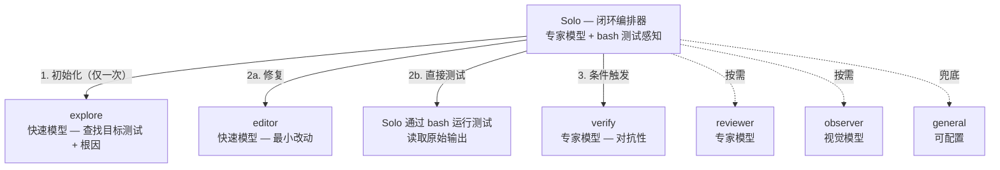
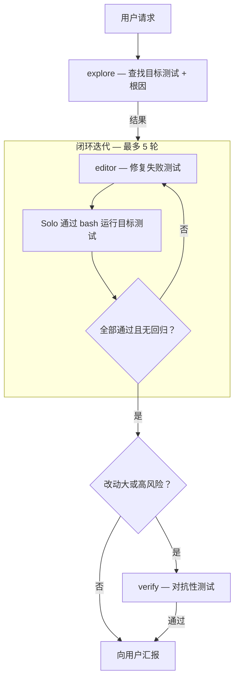

<p align="center">
  <a href="https://github.com/Dqz00116/opencode-solo">
    <picture>
      <source srcset="./assets/logo-dark.svg" media="(prefers-color-scheme: dark)">
      <source srcset="./assets/logo-light.svg" media="(prefers-color-scheme: light)">
      
    </picture>
  </a>
</p>
<p align="center">为 <a href="https://opencode.ai">opencode</a> 设计的闭环编排器 + 专用子代理系统。</p>
<p align="center">
  
  
  
</p>

<p align="center">
  <a href="./README.md">English</a> |
  <a href="./README.zh-CN.md">简体中文</a>
</p>

---

### 概述

Solo 是一个主代理，编排**闭环工作流**——它直接通过 bash 感知测试结果，将代码修改委派给专门的子代理。迭代执行：编辑 → 运行测试 → 判定，直到目标测试通过。



### 为什么选择 Solo？

**闭环反馈。** Solo 直接通过 bash 运行目标测试并读取原始输出，以失败测试数作为误差信号。它持续迭代直到测试通过——然后立即终止。这消除了开环的"先规划后执行"模式，不再盲目发出改动后祈祷生效。

**上下文隔离，节省 Token。** 大量文件读取和工具输出留在子代理会话中。Solo 的上下文只有摘要和决策（~5-10K token），而非传统单代理累积的 100K+。

> [!TIP]
> 这种分层让你以极低成本获得专家级的规划和验证——专家模型只需处理 10K token，而不是 100K+。

**专家模型规划 + 快速模型执行。** Solo 的小上下文让你可以用专家模型做编排决策，同时用快速便宜的模型做机械执行：

| 层级 | 代理 | 原因 |
|------|------|------|
| **专家** | Solo, verify, reviewer | 规划、对抗性分析、质量判断 |
| **快速** | explore, editor | 文件搜索、代码编辑、测试执行 |
| **专用** | observer | 视觉 / 多模态 |

<details>
<summary>学术支撑</summary>

这一架构有活跃的学术研究支撑：

1. Cai, T., Wang, X., Ma, T., Chen, X., & Zhou, D. (2023). [Large Language Models as Tool Makers](https://arxiv.org/abs/2305.17126). *arXiv preprint arXiv:2305.17126*. Google DeepMind.
2. Chen, L., Zaharia, M., & Zou, J. (2023). [FrugalGPT: How to Use Large Language Models While Reducing Cost and Improving Performance](https://arxiv.org/abs/2305.05176). *arXiv preprint arXiv:2305.05176*. Stanford University.
3. Ong, I., Almahairi, A., Wu, V., Chiang, W.-L., Wu, T., Gonzalez, J. E., Kadous, M. W., & Stoica, I. (2024). [RouteLLM: Learning to Route LLMs with Preference Data](https://arxiv.org/abs/2406.18665). *arXiv preprint arXiv:2406.18665*. UC Berkeley.
4. Hong, S., Zhuge, M., Chen, J., Zheng, X., Cheng, Y., Zhang, C., et al. (2024). [MetaGPT: Meta Programming for A Multi-Agent Collaborative Framework](https://arxiv.org/abs/2308.00352). In *ICLR 2024*.
5. Qian, C., Liu, W., Liu, H., Chen, N., Dang, Y., et al. (2024). [ChatDev: Communicative Agents for Software Development](https://arxiv.org/abs/2307.07924). In *ACL 2024*.

</details>

### 基准测试

在 **SWE-bench Verified** 上评测（50 个随机实例，DeepSeek v4-pro / v4-flash）：

**总体对比：**

| 指标 | Solo | 单体 Build |
|------|------|-----------|
| **解决率** | 35/50 (70%) | 34/50 (68%) |
| **总输入 token** | 63.9M | 63.2M |
| **总输出 token** | 653K | 432K |
| **平均耗时** | 356 秒 | 296 秒 |
| **停滞超时** | 5 | 3 |
| **缓存命中率** | 95.4% | 97.1% |

**各代理 token 分布（Solo）：**

| 代理 | 输入 token | 输出 token | 会话数 | 模型 | 职责 |
|------|-----------|-----------|--------|------|------|
| **solo** | 29.2M | 243K | 50 | v4-pro | 编排 + 测试感知 |
| **explore** | 31.7M | 326K | 54 | v4-flash | 代码库映射 + 测试执行 |
| **editor** | 1.5M | 48K | 66 | v4-flash | 代码修改（最小改动） |
| **verify** | 1.4M | 36K | 3 | v4-pro | 条件对抗验证（极少触发） |

> [!TIP]
> Solo 将 **52% 的 token**（33.2M）放在更便宜的 v4-flash 模型上（explore + editor），而 Build 全程使用 v4-pro。总 token 量相近（63.9M vs 63.2M），但 Solo 的宏观成本更低——分层架构以更低价格交付专家级编排。

> [!NOTE]
> SWE-bench 的实例是**单 bug 修复任务**——小规模、自包含、短周期。这并非 Solo 多代理架构的主场。在这些任务上，Solo 在解决率和总 token 上**与单体持平**，尽管有编排开销。
>
> Solo 的真正优势在于**长周期、多文件任务**——上下文管理、专门化探索和迭代验证的复合收益在此显现。这套架构为复杂工程设计，而非孤立的 bug 修复。
>
> 以上数据仅供参考，实际效果取决于具体任务、模型和运行环境。
### 子代理

- **solo** - 闭环编排器。通过 bash 运行测试，委派编辑给 @editor，基于原始测试输出判定。除 bash 测试执行外只读。
- **explore** - 只读研究。快速模型。仅运行一次：搜索代码库，查找目标测试，识别根因。
- **editor** - 文件读写 + Shell。快速模型。最小化聚焦修改。不自行测试。
- **verify** - 对抗性验证。专家模型。条件触发——仅用于大改动或高风险变更。
- **reviewer** - 代码质量审查。专家模型。按需触发。
- **observer** - 视觉分析。视觉模型。截图、图表、图像。
- **general** - 兜底。研究 + 执行一体。

### 快速开始

**1. 安装 agent 文件**

```bash
git clone https://github.com/Dqz00116/opencode-solo.git
cp opencode-solo/agent/*.md ~/.config/opencode/agent/
```

> [!TIP]
> Windows PowerShell：`Copy-Item opencode-solo\agent\*.md $env:USERPROFILE\.config\opencode\agent\`

**2. 配置模型**

Agent 文件**不绑定模型**。在 `opencode.jsonc` 中为每个 agent 映射 provider：

```bash
cp opencode-solo/opencode.jsonc.example ~/.config/opencode/opencode.jsonc
```

编辑文件——把占位符替换成你自己的模型。详见 [opencode.jsonc.example](./opencode.jsonc.example)。

**3. 启用后台子代理**（推荐）

```bash
# macOS / Linux
export OPENCODE_EXPERIMENTAL_BACKGROUND_SUBAGENTS=true
```

```powershell
# Windows PowerShell（持久设置，需重启终端）
[System.Environment]::SetEnvironmentVariable("OPENCODE_EXPERIMENTAL_BACKGROUND_SUBAGENTS", "true", "User")
```

**4. 启动 opencode，选择 `solo` agent。**

### 工作流程



### 文件结构

```
agent/
├── solo.md         编排器——闭环，bash 测试感知 + editor 委派
├── explore.md      初始化器——查找目标测试 + 根因（仅运行一次）
├── editor.md       执行器——最小改动，不自行测试
├── verify.md       条件对抗验证——仅用于大/高风险改动
├── general.md      兜底——研究 + 执行一体
├── observer.md     视觉——截图、图表、图像分析
└── reviewer.md     代码审查——质量、架构、约定
```

所有 `.md` 文件只包含行为定义（提示词、权限、模式）。模型在 `opencode.jsonc` 中单独配置。

### 环境要求

- [opencode](https://opencode.ai)
- 至少配置一个 LLM provider
