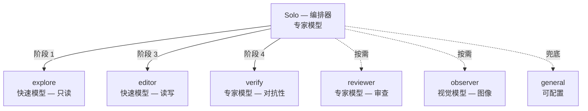
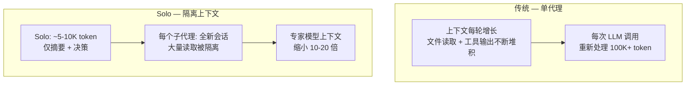
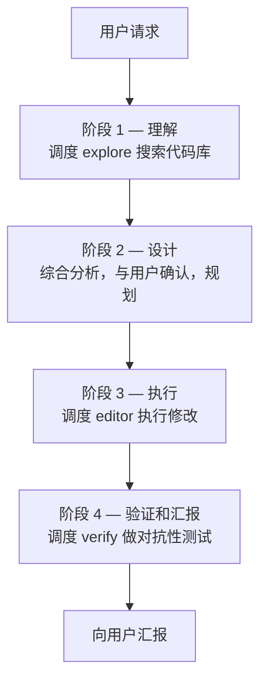

<p align="center">
  <a href="https://github.com/Dqz00116/opencode-solo">
    <picture>
      <source srcset="./assets/logo-dark.svg" media="(prefers-color-scheme: dark)">
      <source srcset="./assets/logo-light.svg" media="(prefers-color-scheme: light)">
      
    </picture>
  </a>
</p>
<p align="center">为 <a href="https://opencode.ai">opencode</a> 设计的只读编排器 + 专用子代理系统。</p>
<p align="center">
  
  
</p>

<p align="center">
  <a href="./README.md">English</a> |
  <a href="./README.zh-CN.md">简体中文</a>
</p>

---

### 概述

Solo 是一个主代理，**从不直接操作文件**——它负责规划、委派、验证和汇报。所有实际操作都通过专用子代理完成，每个子代理有独立的会话、权限和系统提示词。



### 为什么选择 Solo？

**上下文隔离，节省 Token。** 传统单代理模式下，每次读文件和工具输出都堆积在同一个不断增长的上下文里——每次 LLM 调用都要重新处理 100K+ token。Solo 把每个任务隔离在独立的子代理会话中，Solo 的上下文始终只有 ~5-10K token 的摘要和决策。



**专家模型规划 + 快速模型执行。** 因为 Solo 的上下文很小，你可以用专家模型做编排决策，同时用快速便宜的模型做机械执行：

| 层级 | 代理 | 原因 |
|------|------|------|
| **专家** | Solo, verify, reviewer | 规划、对抗性分析、质量判断 |
| **快速** | explore, editor | 文件搜索、代码编辑、Shell 命令 |
| **专用** | observer | 视觉 / 多模态 |

> [!TIP]
> 这种分层让你以极低成本获得专家级的规划和验证——专家模型只需处理 10K token，而不是 100K+。

<details>
<summary>学术支撑</summary>

这一架构有活跃的学术研究支撑：

1. Cai, T., Wang, X., Ma, T., Chen, X., & Zhou, D. (2023). [Large Language Models as Tool Makers](https://arxiv.org/abs/2305.17126). *arXiv preprint arXiv:2305.17126*. Google DeepMind.
2. Chen, L., Zaharia, M., & Zou, J. (2023). [FrugalGPT: How to Use Large Language Models While Reducing Cost and Improving Performance](https://arxiv.org/abs/2305.05176). *arXiv preprint arXiv:2305.05176*. Stanford University.
3. Ong, I., Almahairi, A., Wu, V., Chiang, W.-L., Wu, T., Gonzalez, J. E., Kadous, M. W., & Stoica, I. (2024). [RouteLLM: Learning to Route LLMs with Preference Data](https://arxiv.org/abs/2406.18665). *arXiv preprint arXiv:2406.18665*. UC Berkeley.
4. Hong, S., Zhuge, M., Chen, J., Zheng, X., Cheng, Y., Zhang, C., et al. (2024). [MetaGPT: Meta Programming for A Multi-Agent Collaborative Framework](https://arxiv.org/abs/2308.00352). In *ICLR 2024*.
5. Qian, C., Liu, W., Liu, H., Chen, N., Dang, Y., et al. (2024). [ChatDev: Communicative Agents for Software Development](https://arxiv.org/abs/2307.07924). In *ACL 2024*.

</details>

### 子代理

- **solo** - 编排器。零文件/Shell 权限。规划、委派、验证、汇报。
- **explore** - 只读研究。快速模型。搜索代码库，查找文件，回答问题。
- **editor** - 文件读写 + Shell。快速模型。严格按照指令执行修改。
- **verify** - 对抗性验证。专家模型。试图找出问题——跑真实探针，猎杀边界情况。
- **reviewer** - 代码质量审查。专家模型。按需触发。评估可读性、架构、命名、约定。
- **observer** - 视觉分析。视觉模型。截图、图表、图像。
- **general** - 兜底。研究 + 执行一体。

### 快速开始

**1. 安装 agent 文件**

```bash
git clone https://github.com/Dqz00116/opencode-solo.git
cp opencode-solo/agent/*.md ~/.config/opencode/agent/
```

> [!TIP]
> Windows PowerShell：`Copy-Item opencode-solo\agent\*.md $env:USERPROFILE\.config\opencode\agent\`

**2. 配置模型**

Agent 文件**不绑定模型**。在 `opencode.jsonc` 中为每个 agent 映射 provider：

```bash
cp opencode-solo/opencode.jsonc.example ~/.config/opencode/opencode.jsonc
```

编辑文件——把占位符替换成你自己的模型。详见 [opencode.jsonc.example](./opencode.jsonc.example)。

**3. 启用后台子代理**（推荐）

```bash
# macOS / Linux
export OPENCODE_EXPERIMENTAL_BACKGROUND_SUBAGENTS=true
```

```powershell
# Windows PowerShell（持久设置，需重启终端）
[System.Environment]::SetEnvironmentVariable("OPENCODE_EXPERIMENTAL_BACKGROUND_SUBAGENTS", "true", "User")
```

**4. 启动 opencode，选择 `solo` agent。**

### 工作流程



### 文件结构

```
agent/
├── solo.md         编排器——只读，委派一切
├── verify.md       对抗性验证——试图找出问题
├── explore.md      只读研究——快速并行搜索代码库
├── editor.md       执行——文件读写和 Shell 命令
├── general.md      兜底——研究 + 执行一体
├── observer.md     视觉——截图、图表、图像分析
└── reviewer.md     代码审查——质量、架构、约定
```

所有 `.md` 文件只包含行为定义（提示词、权限、模式）。模型在 `opencode.jsonc` 中单独配置。

### 环境要求

- [opencode](https://opencode.ai)
- 至少配置一个 LLM provider